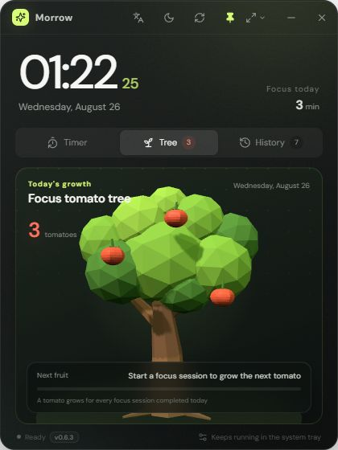

# Morrow Desk Clock

[简体中文](README.md) | English

A lightweight desktop clock and focus companion for Windows 11, built with Tauri 2, React, TypeScript, and Three.js—without Electron.

Current stable release: [`v0.6.4`](https://github.com/GrayJS/desk-clock/releases/latest)

## Preview



## Download and Install

1. Open [GitHub Releases](https://github.com/GrayJS/desk-clock/releases/latest).
2. Download the latest x64 setup executable from the release assets.
3. Run the installer and launch Morrow.

Windows 10/11 x64 and Microsoft Edge WebView2 are required. WebView2 is normally preinstalled on Windows 11.

## Features

- Live clock and date with always-on-top enabled by default
- Compact, standard, and expanded window presets with free resizing and dragging
- Dark, light, and Windows system theme modes
- Instant Simplified Chinese and English switching
- Focus, short-break, and long-break timer modes
- Quick duration presets and custom 1–180 minute countdowns
- Current goal, quick notes, and completed focus-session history
- System tray background mode with restore and quit actions
- Optional start at login, synchronized with the actual Windows startup entry
- Native background timing and Windows notifications when a session ends
- Frameless transparent window, responsive layout, and Windows 11-inspired motion

## Daily Focus Tomato Tree

- A low-poly achievement tree rendered with Three.js
- One tomato is added for every focus session completed that day
- During a countdown, the next tomato grows from a small green fruit into a ripe red tomato
- Pausing preserves its current maturity; resetting or switching modes cancels that growth
- Tomato counts follow today's completed focus records and start fresh on a new local date
- The tree includes breathing, swaying, pointer parallax, and responsive scaling animations

## Updates

- Checks for a signed update once after launch
- Checks for new versions every hour in the background
- Provides a manual update-check button in the title bar
- Downloads and installs updates silently while idle, without a manual reinstall
- Defers installation during an active focus timer and only offers a manual download if automatic updating fails
- Reports when Morrow is up to date or when the network check fails
- Displays the current application version in the footer

## Data and Privacy

- Focus history, the current goal, durations, theme, and language settings stay in local `localStorage`
- No account is required
- Focus history and quick notes are never uploaded
- User data is never uploaded; network access may be used to load interface fonts and check or download signed updates

## Development

Node.js 20+, Rust stable, Windows WebView2, and an NSIS build environment are required.

```powershell
npm install
npm run tauri dev
```

To run only the frontend preview:

```powershell
npm run dev
```

## Build the Installer

```powershell
npm run tauri build
```

The localized NSIS installer is generated in:

```text
src-tauri/target/release/bundle/nsis/
```

Pushing a `v*` tag that matches the version in `tauri.conf.json` runs the GitHub
Actions release workflow. It uploads the signed installer, `.sig`, and updater
manifest (`latest.json`). CI reads the `TAURI_SIGNING_PRIVATE_KEY` and
`TAURI_SIGNING_PRIVATE_KEY_PASSWORD` repository secrets; keep any local backup
outside this repository.

## Project Structure

```text
src/                         React + TypeScript interface
src/components/FocusTree.tsx Three.js daily achievement tree
src/lib/                     Window, background notification, and updater helpers
src-tauri/src/lib.rs         Tauri tray, notification, and native window logic
docs/                        README screenshots
```

## Tech Stack

- Tauri 2
- React 18
- TypeScript
- Three.js
- Vite
- Rust

## License

This project is available under the [MIT License](LICENSE). You may use, modify,
and distribute it as long as the original copyright and license notice are kept.
