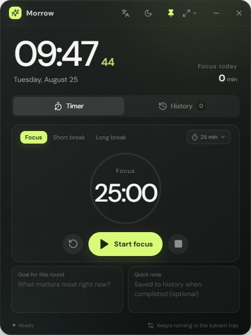

# Morrow Desk Clock

[简体中文](README.md) | English

A lightweight desktop clock for Windows 11, built with Tauri 2, React, and TypeScript—without Electron.

## Preview



## Features

- Live clock and date with always-on-top enabled by default
- Compact, standard, and expanded window presets with free resizing
- Dark, light, and Windows system theme modes
- Centralized internationalization resources with instant Simplified Chinese and English switching
- Quick duration presets and custom 1–180 minute countdowns for focus, short-break, and long-break modes
- A daily Three.js achievement tree that grows one tomato for every completed focus session
- Current goal, quick notes, and completed focus-session history
- Runs in the system tray when minimized or closed, with restore and quit actions
- Native background timer with Windows notifications when a session ends
- Checks GitHub Releases at startup and every 6 hours, then prompts when an update is available
- All user data stays on the device in `localStorage`
- Frameless transparent window, responsive layout, and Windows 11-inspired motion

## Development

Requires Node.js 20+, Rust stable, and Windows WebView2.

```powershell
npm install
npm run tauri dev
```

## Build the Installer

```powershell
npm run tauri build
```

The NSIS installer is generated in `src-tauri/target/release/bundle/nsis`.
