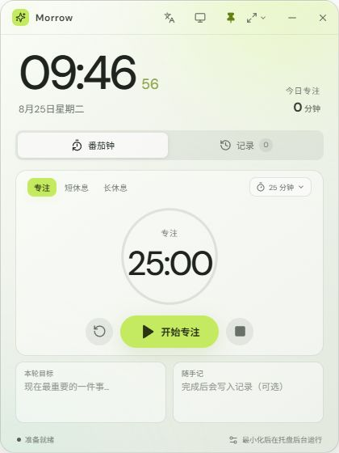

# Morrow 桌面时钟

简体中文 | [English](README.en.md)

一款面向 Windows 11 的轻量桌面时钟。使用 Tauri 2、React 和 TypeScript 构建，不依赖 Electron。

## 效果预览



## 功能

- 实时时钟与日期，窗口默认置顶
- 迷你、标准、展开三种窗口尺寸，也支持自由缩放
- 深色、浅色与跟随 Windows 系统三种主题模式
- 集中式国际化语言资源，支持简体中文与 English 即时切换
- 专注、短休息、长休息的快捷时长档位与 1–180 分钟自定义倒计时
- 当前目标、随手记与专注完成记录
- 最小化或关闭后驻留系统托盘，可从托盘恢复或退出
- 番茄钟结束时由原生后台计时器发送 Windows 通知
- 启动及每 6 小时检查 GitHub Release，发现新版本时提醒更新
- 数据仅通过 `localStorage` 保存在本机
- 无边框透明窗口、响应式布局与 Windows 11 风格动效

## 开发

需要 Node.js 20+、Rust stable 和 Windows WebView2。

```powershell
npm install
npm run tauri dev
```

## 构建安装包

```powershell
npm run tauri build
```

安装包会生成在 `src-tauri/target/release/bundle/nsis`。
