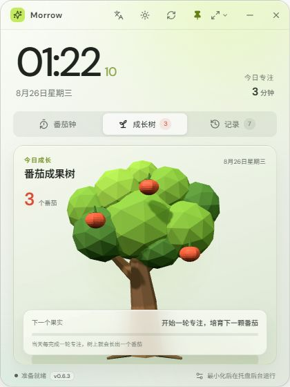

# Morrow 桌面时钟

简体中文 | [English](README.en.md)

一款面向 Windows 11 的轻量桌面时钟与专注工具。使用 Tauri 2、React、TypeScript 和 Three.js 构建，不依赖 Electron。

当前稳定版本：[`v0.6.5`](https://github.com/GrayJS/desk-clock/releases/latest)

## 效果预览



## 下载与安装

1. 打开 [GitHub Releases](https://github.com/GrayJS/desk-clock/releases/latest)。
2. 下载最新的 `Morrow 桌面时钟_*_x64-setup.exe`。
3. 运行安装包并启动 Morrow。

需要 Windows 10/11 x64 与 Microsoft Edge WebView2。Windows 11 通常已经预装 WebView2。

## 主要功能

- 实时时钟与日期，窗口默认置顶
- 迷你、标准、展开三种窗口尺寸，也支持自由缩放和拖动
- 深色、浅色与跟随 Windows 系统三种主题模式
- 简体中文与 English 即时切换
- 专注、短休息、长休息三种计时模式
- 常用时长快捷档位与 1–180 分钟自定义倒计时
- 本轮目标、随手记和专注完成记录
- 最小化或关闭后驻留系统托盘，可从托盘恢复或退出
- 可选开机自启动，并与 Windows 实际启动项状态同步
- 原生后台计时，完成后发送 Windows 通知
- 无边框透明窗口、响应式布局与 Windows 11 风格动效

## 每日番茄成果树

- Three.js 渲染低多边形动态成长树
- 当天每完成一轮专注，树上增加一颗番茄
- 倒计时期间，下一颗番茄会从绿色小果逐渐长大并成熟变红
- 暂停时保留当前成熟度，重置或切换模式后取消本轮生长
- 番茄数量按当天专注记录计算，日期变化后从新的每日成果树开始
- 树体支持呼吸、摆动、鼠标视差和响应式缩放动画

## 版本更新

- 启动应用后自动检查一次签名更新
- 后台每 1 小时检查一次新版本
- 标题栏提供手动检查更新按钮
- 空闲时在后台静默下载并安装，不需要重新下载安装包
- 专注计时进行中会延后安装，自动更新失败时才提供手动下载入口
- 检查结果会反馈“已是最新版本”或网络错误状态
- 当前应用版本显示在底部状态栏

## 数据与隐私

- 专注记录、当前目标、时长、主题和语言设置均保存在本机 `localStorage`
- 不需要注册账号
- 不上传专注记录或随手记
- 不会上传用户数据；网络可能用于加载界面字体以及检查、下载签名更新

## 本地开发

需要 Node.js 20+、Rust stable、Windows WebView2 和 NSIS 构建环境。

```powershell
npm install
npm run tauri dev
```

仅运行前端预览：

```powershell
npm run dev
```

## 构建安装包

```powershell
npm run tauri build
```

中文 NSIS 安装包会生成在：

```text
src-tauri/target/release/bundle/nsis/
```

推送与 `tauri.conf.json` 版本一致的 `v*` 标签后，GitHub Actions 会构建 Release，
并同时上传签名安装包、`.sig` 与更新清单 `latest.json`。CI 使用仓库中的
`TAURI_SIGNING_PRIVATE_KEY` 和 `TAURI_SIGNING_PRIVATE_KEY_PASSWORD` Secrets；
本机备份应始终放在仓库之外。

## 项目结构

```text
src/                         React + TypeScript 界面
src/components/FocusTree.tsx Three.js 每日成果树
src/lib/                     窗口、后台通知与更新检测
src-tauri/src/lib.rs         Tauri 托盘、通知和原生窗口逻辑
docs/                        README 效果截图
```

## 技术栈

- Tauri 2
- React 18
- TypeScript
- Three.js
- Vite
- Rust

## 开源协议

本项目采用 [MIT License](LICENSE)。你可以自由使用、修改和分发，但需保留原始版权与许可声明。
